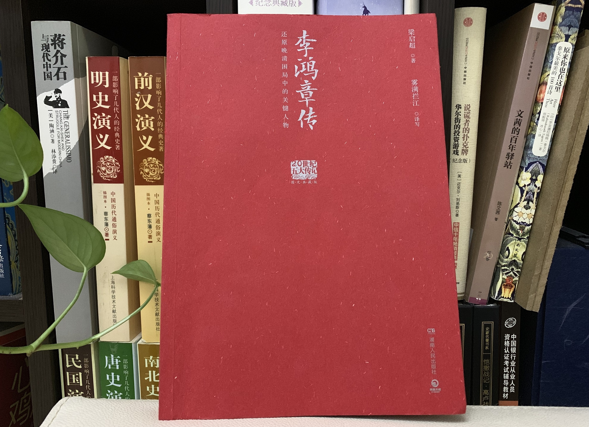

# 梁启超《李鸿章传》读书笔记

一本买了比较久，一直没读的书。  
篇幅并不长，最近决定开始了。  

<hr>

## 目录

- [梁启超《李鸿章传》读书笔记](#梁启超李鸿章传读书笔记)
  - [目录](#目录)
  - [更新日志](#更新日志)
  - [写在开头](#写在开头)

<hr>

## 更新日志

|修改人|修改日期|修改内容|
|-|-|-|
|朱里|2022.07.17|阅读序例至第二章。|

<hr>

[](https://book.douban.com/subject/11629131/)

## 写在开头

然而没什么想说的。  

```
入都 其一
丈夫只手把吴钩，意气高于百尺楼。一万年来谁著史? 三千里外欲封侯。
定将捷足随途骥，哪有闲情逐野鸥? 笑指泸沟桥畔月，几人从此到瀛洲!
```

```
入都 其七
一枕邯郸梦醒迟，蓬瀛虽远系人思。出山志在登鳌顶，何日身才入凤池?
诗酒未除名士习，公卿须趁少年时。碧鸡金马寻常事，总要生来福分宜。
```

```
入都 其十
一入都门便到家，征人北上日西斜。槐厅谬赴明经选，桂苑犹虚及第花。
世路恩仇收短剑，人情冷暖验笼纱。倘无驷马高车日，誓不重回故里车。
```
